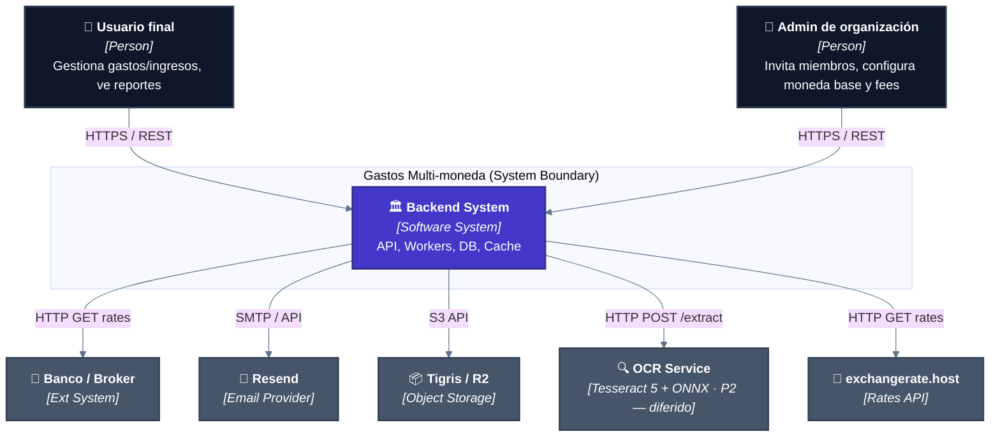
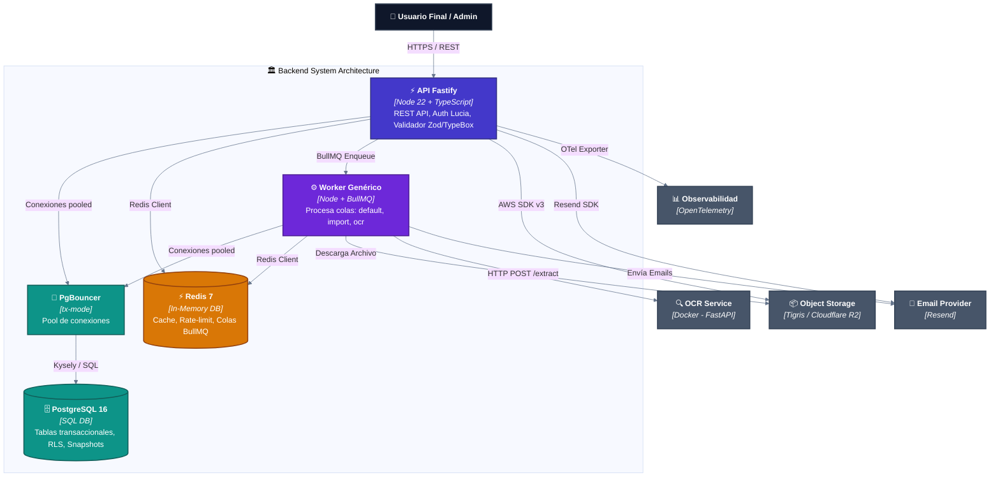
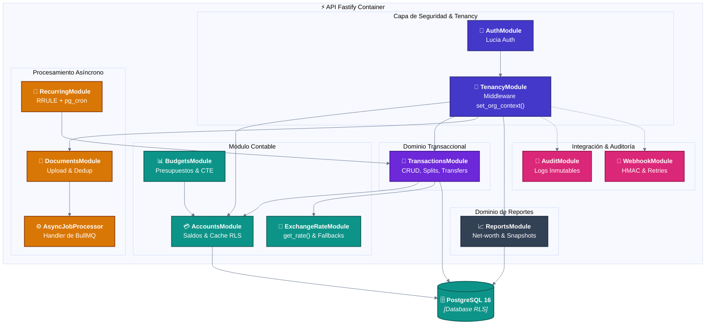

# Diagramas C4 - SaaS Multi-moneda Multi-tenant (Backend)

---
## 1. Nivel 1 - Contexto del Sistema

> **Nota**: OCR (US-14) está diferido a **P2** — perfil comentado en `docker-compose.yml`.

---
## 2. Nivel 2 - Contenedores

> **Nota dev**: en desarrollo, MinIO (S3 local) y Mailpit (SMTP local) corren vía `docker compose up -d`; en producción se usarían Tigris/R2 y Resend.

---
## 3. Nivel 3 - Componentes (dentro de la API)

