# Diagrama Entidad-Relación - SaaS Multi-moneda Multi-tenant

```mermaid
%%{init: {
  'theme': 'black',
  'themeVariables': {
    'primaryColor': '#1E293B',
    'primaryTextColor': '#F8FAFC',
    'primaryBorderColor': '#475569',
    'lineColor': '#38BDF8',
    'tertiaryColor': '#0F172A',
    'tertiaryBorderColor': '#334155'
  }
}}%%
erDiagram
    %% ===================== CORE TENANCY =====================
    organizations ||--o{ memberships : "tiene"
    organizations ||--o{ invitations : "emite"
    organizations ||--o{ accounts : "posee"
    organizations ||--o{ categories : "define"
    organizations ||--o{ transactions : "registra"
    organizations ||--o{ transfers : "ejecuta"
    organizations ||--o{ fee_templates : "configura"
    organizations ||--o{ exchange_rates : "overrides"
    organizations ||--o{ budgets : "establece"
    organizations ||--o{ recurring_rules : "programa"
    organizations ||--o{ documents : "almacena"
    organizations ||--o{ audit_logs : "audita"
    organizations ||--o{ idempotency_keys : "protege"
    organizations ||--o{ account_balance_dirty : "invalida"
    organizations ||--o{ account_balances_cache : "cachea"
    organizations ||--o{ net_worth_snapshots : "snapshot"
    organizations ||--o{ webhook_endpoints : "expone"
    organizations ||--o{ api_keys : "autentica"
    organizations ||--o{ notifications : "notifica"

    users ||--o{ memberships : "pertenece"
    users ||--o{ audit_logs : "ejecuta"
    users ||--o{ notifications : "recibe"
    users ||--o{ notification_preferences : "configura"

    memberships }|--|| organizations : "org"
    memberships }|--|| users : "user"

    invitations }|--|| organizations : "org"

    %% ===================== CATÁLOGOS =====================
    currencies ||--o{ organizations : "base_de"
    currencies ||--o{ accounts : "denomina"
    currencies ||--o{ transactions : "original"
    currencies ||--o{ transactions : "base_como"
    currencies ||--o{ transfers : "from_curr"
    currencies ||--o{ transfers : "to_curr"
    currencies ||--o{ fee_templates : "fee_curr"
    currencies ||--o{ exchange_rates : "base"
    currencies ||--o{ exchange_rates : "quote"
    currencies ||--o{ recurring_rules : "denomina"
    currencies ||--o{ document_line_items : "denomina"

    %% ===================== CUENTAS & SALDOS =====================
    accounts }|--|| organizations : "org"
    accounts }|--|| currencies : "currency"
    accounts ||--o{ transactions : "movimientos"
    accounts ||--o{ transfers : "from_acct"
    accounts ||--o{ transfers : "to_acct"
    accounts ||--o{ recurring_rules : "origen"
    accounts ||--o{ documents : "soporte"
    accounts ||--o{ account_balance_dirty : "marca_sucia"
    accounts ||--|| account_balances_cache : "cache_1a1"

    account_balances_cache }|--|| organizations : "org"
    account_balances_cache }|--|| accounts : "account"

    account_balance_dirty }|--|| organizations : "org"
    account_balance_dirty }|--|| accounts : "account"

    %% ===================== CATEGORÍAS (ÁRBOL) =====================
    categories }|--|| organizations : "org"
    categories }|--o| categories : "padre_hijo"
    categories ||--o{ transactions : "clasifica"
    categories ||--o{ budgets : "presupuesta"
    categories ||--o{ recurring_rules : "categoriza"
    categories ||--o{ document_line_items : "sugiere"

    %% ===================== TRANSACCIONES =====================
    transactions }|--|| organizations : "org"
    transactions }|--|| accounts : "account"
    transactions }|--o| categories : "category"
    transactions }|--o| transfers : "transfer"
    transactions }|--|| currencies : "currency"
    transactions }|--|| currencies : "base_currency"
    transactions ||--o{ transaction_splits : "divide_en"

    transaction_splits }|--|| transactions : "txn"
    transaction_splits }|--|| categories : "category"

    %% ===================== TRANSFERENCIAS REALES =====================
    transfers }|--|| organizations : "org"
    transfers }|--|| accounts : "from_account"
    transfers }|--|| accounts : "to_account"
    transfers }|--|| currencies : "from_currency"
    transfers }|--|| currencies : "to_currency"
    transfers }|--o| fee_templates : "fee_template"
    transfers }|--|| exchange_rates : "market_rate"

    fee_templates }|--|| organizations : "org"
    fee_templates }|--|| currencies : "fee_currency"

    %% ===================== TIPOS DE CAMBIO =====================
    exchange_rates }|--o| organizations : "org_override"
    exchange_rates }|--|| currencies : "base"
    exchange_rates }|--|| currencies : "quote"

    %% ===================== PRESUPUESTOS =====================
    budgets }|--|| organizations : "org"
    budgets }|--|| categories : "category"

    %% ===================== RECURRENTES =====================
    recurring_rules }|--|| organizations : "org"
    recurring_rules }|--|| accounts : "account"
    recurring_rules }|--o| categories : "category"
    recurring_rules }|--|| currencies : "currency"

    %% ===================== DOCUMENTOS & OCR =====================
    documents }|--|| organizations : "org"
    documents }|--|| accounts : "account"
    documents ||--o{ document_line_items : "contiene"

    document_line_items }|--|| documents : "document"
    document_line_items }|--o| categories : "category_sugerida"
    document_line_items }|--|| currencies : "currency"

    %% ===================== AUDITORÍA & IDEMPOTENCIA =====================
    audit_logs }|--|| organizations : "org"
    audit_logs }|--o| users : "actor"

    idempotency_keys }|--|| organizations : "org"

    %% ===================== NET WORTH =====================
    net_worth_snapshots }|--|| organizations : "org"

    %% ===================== WEBHOOKS & API KEYS =====================
    webhook_endpoints }|--|| organizations : "org"
    api_keys }|--|| organizations : "org"

    %% ===================== NOTIFICACIONES =====================
    notifications }|--|| organizations : "org"
    notifications }|--|| users : "user"

    notification_preferences }|--|| users : "user"

    %% ===================== ENTIDADES CON ATRIBUTOS =====================
    organizations {
        uuid id PK
        string name
        uuid base_currency_id FK
        timestamp created_at
        timestamp updated_at
    }

    users {
        uuid id PK
        string email
        string password_hash
        string totp_secret
        boolean totp_enabled
        timestamp email_verified_at
        timestamp created_at
        timestamp updated_at
    }

    memberships {
        uuid id PK
        uuid org_id FK
        uuid user_id FK
        string role "owner | admin | member | viewer"
        timestamp invited_at
        timestamp accepted_at
        timestamp created_at
    }

    invitations {
        uuid id PK
        uuid org_id FK
        string email
        string role "owner | admin | member | viewer"
        string token
        timestamp expires_at
        timestamp accepted_at
        timestamp created_at
    }

    currencies {
        string code PK "ISO-4217"
        string name
        string symbol
        smallint decimals
        boolean is_active
    }

    accounts {
        uuid id PK
        uuid org_id FK
        string name
        string type "cash | bank | card | crypto | investment"
        uuid currency_id FK
        boolean is_active
        timestamp created_at
        timestamp updated_at
        timestamp deleted_at
    }

    categories {
        uuid id PK
        uuid org_id FK
        uuid parent_id FK "self-ref"
        string name
        string type "expense | income | transfer"
        string color
        string icon
        boolean is_active
        timestamp created_at
    }

    transactions {
        uuid id PK
        uuid org_id FK
        uuid account_id FK
        uuid category_id FK
        uuid transfer_id FK "nullable"
        string type "expense | income | transfer_out | transfer_in"
        numeric amount
        uuid currency_id FK
        numeric amount_base
        date txn_date
        string status "pending | cleared | cancelled"
        string description
        jsonb tags
        timestamp created_at
        timestamp updated_at
        timestamp deleted_at
    }

    transaction_splits {
        uuid id PK
        uuid transaction_id FK
        uuid category_id FK
        numeric amount_base
        timestamp created_at
    }

    transfers {
        uuid id PK
        uuid org_id FK
        uuid from_account_id FK
        uuid to_account_id FK
        numeric from_amount
        numeric to_amount
        uuid from_currency_id FK
        uuid to_currency_id FK
        uuid fee_template_id FK
        jsonb user_fee_override
        uuid market_rate_id FK
        string status "draft | confirmed | cancelled"
        date txn_date
        timestamp created_at
        timestamp updated_at
    }

    fee_templates {
        uuid id PK
        uuid org_id FK
        string entity_name
        numeric fixed_fee
        numeric pct_fee
        numeric min_fee
        numeric max_fee
        uuid fee_currency_id FK
        boolean is_active
        timestamp created_at
    }

    exchange_rates {
        uuid id PK
        uuid org_id FK "nullable = global"
        uuid base_currency_id FK
        uuid quote_currency_id FK
        numeric rate
        date rate_date
        string source "api | manual | override"
        timestamp created_at
    }

    budgets {
        uuid id PK
        uuid org_id FK
        uuid category_id FK
        date month "first day"
        numeric amount_base
        jsonb alert_thresholds "80,100,120"
        timestamp created_at
    }

    recurring_rules {
        uuid id PK
        uuid org_id FK
        uuid account_id FK
        uuid category_id FK
        string rrule "RFC-5545"
        numeric amount
        uuid currency_id FK
        jsonb template_data
        date next_run
        date last_run
        boolean is_active
        timestamp created_at
        timestamp updated_at
    }

    documents {
        uuid id PK
        uuid org_id FK
        uuid account_id FK
        string content_hash "SHA-256"
        string mime_type
        integer size_bytes
        string storage_path
        jsonb extracted_data
        string status "uploaded | processing | extracted | confirmed | rejected"
        timestamp created_at
        timestamp updated_at
    }

    document_line_items {
        uuid id PK
        uuid document_id FK
        date txn_date
        numeric amount
        uuid currency_id FK
        string vendor
        string iban
        uuid category_id FK "sugerida"
        timestamp created_at
    }

    audit_logs {
        uuid id PK
        uuid org_id FK
        uuid user_id FK "nullable"
        string action
        string entity
        uuid entity_id
        jsonb diff_jsonb
        timestamp created_at
    }

    idempotency_keys {
        uuid id PK
        uuid org_id FK
        string key
        jsonb response_json
        timestamp created_at
        timestamp expires_at
    }

    account_balance_dirty {
        uuid id PK
        uuid org_id FK
        uuid account_id FK
        timestamp created_at
    }

    account_balances_cache {
        uuid org_id PK "FK"
        uuid account_id PK "FK"
        numeric balance_cleared
        numeric balance_pending
        timestamp updated_at
    }

    net_worth_snapshots {
        uuid id PK
        uuid org_id FK
        date snapshot_date
        numeric total_base
        jsonb breakdown_jsonb
        timestamp created_at
    }

    webhook_endpoints {
        uuid id PK
        uuid org_id FK
        string url
        jsonb events
        string secret
        boolean active
        integer retry_count
        timestamp created_at
        timestamp updated_at
    }

    api_keys {
        uuid id PK
        uuid org_id FK
        string name
        string key_hash
        jsonb scopes
        timestamp last_used_at
        timestamp expires_at
        boolean active
        timestamp created_at
    }

    notifications {
        uuid id PK
        uuid org_id FK
        uuid user_id FK
        string type "budget_exceeded | recurring_due | transfer_pending | custom"
        jsonb payload_json
        timestamp read_at
        timestamp created_at
    }

    notification_preferences {
        uuid id PK
        uuid user_id FK
        string channel "email | in_app | push"
        string event_type "budget_exceeded | recurring_due | transfer_pending | custom"
        boolean enabled
    }
```

> **Nota**: los saldos **no** viven en `accounts` - se calculan por triggers/dirty-table y se leen de `account_balances_cache` (plan 1.4, NUMERIC(18,6)). Las entidades `documents`, `document_line_items`, `webhook_endpoints`, `api_keys`, `notifications` y `notification_preferences` son dominio **P2+** (fuera del MVP P0) y se incluyen como referencia del modelo completo.
